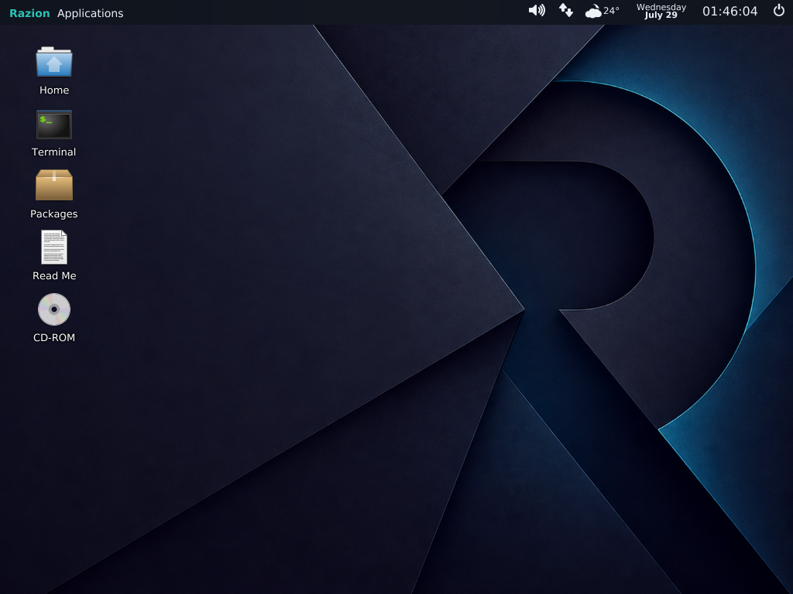

# RazionOS

**Current milestone: 0.1 Alpha**

RazionOS is an experimental desktop operating system focused on a coherent,
fast, Unix-like graphical environment for virtual machines. The 0.1 Alpha
milestone establishes the Razion identity, Razion Desktop, a dark visual
system, and a reproducible x86_64 live ISO.



> [!WARNING]
> RazionOS is alpha software intended for learning, experimentation, and
> development. It is not hardened for production use. Run it in an isolated
> virtual machine and do not expose it to untrusted networks or data.

## Highlights

- Razion Desktop with a composited graphical environment
- Razion Dark theme, custom wallpaper, launcher, panel, and system dialogs
- SMP-capable x86_64 kernel with loadable modules
- C library, dynamic linker, terminal emulator, shell, and POSIX-style tools
- Bim editor and Kuroko language environment
- BIOS and x86_64 UEFI loaders packaged in a bootable live ISO

The first public milestone is intentionally conservative: it establishes a
stable identity and verified build before larger architectural changes.

## Run the live ISO

The build produces `image.iso`. A virtual machine with the following baseline
configuration is recommended:

- 64-bit “Other/Unknown” guest
- 1 GiB RAM or more
- 2 virtual CPUs
- Intel PRO/1000 network adapter
- Intel AC'97 audio
- the ISO attached as a virtual optical disk

For QEMU:

```sh
qemu-system-x86_64 -m 1G -smp 2 -device AC97 -cdrom image.iso
```

KVM users may add `-enable-kvm`. VirtualBox-specific settings and the recorded
baseline are documented in [docs/VIRTUALBOX.md](docs/VIRTUALBOX.md).

## Build from source

### Requirements

- Git
- Docker
- an x86_64 Linux host, or Docker Desktop configured for Linux containers

Clone the repository and initialize the runtime submodules:

```sh
git clone https://github.com/Mohammed-razin-cr/RazionOS.git
cd RazionOS
git submodule update --init kuroko bim
```

Build with the pinned upstream toolchain image:

```sh
docker pull toaruos/build-tools:1.99.x
docker run --rm \
  -v "$(pwd):/root/misaka" \
  -w /root/misaka \
  -e LANG=C.UTF-8 \
  -t toaruos/build-tools:1.99.x \
  util/build-in-docker.sh
```

On success, the repository root contains:

- `image.iso` — bootable live image
- `misaka-kernel` and `misaka-kernel.64` — kernel artifacts
- `ramdisk.igz` — compressed userspace ramdisk

Generated outputs are excluded by `.gitignore`. Windows-hosted build details
and filesystem caveats are recorded in
[docs/BUILDING_RAZIONOS.md](docs/BUILDING_RAZIONOS.md).

## Repository layout

- `apps/` — userspace applications
- `base/` — live filesystem configuration and resources
- `boot/` — BIOS and EFI bootloaders
- `kernel/` — kernel sources
- `lib/` and `libc/` — userspace libraries, C library, and dynamic linker
- `modules/` — loadable kernel modules
- `bim/` and `kuroko/` — pinned Git submodules
- `docs/` — architecture, design, build, VM, and screenshot records
- `util/` — build and image-generation tooling

See [docs/README.md](docs/README.md) for the documentation index.

## Release status

RazionOS 0.1 Alpha has been built as a clean x86_64 source checkout and
packaged as a hybrid ISO containing BIOS and x86_64 UEFI boot entries. The
desktop has been boot-tested in VirtualBox. Hardware support, POSIX coverage,
and security hardening remain incomplete.

The aarch64 sources and CI workflow are inherited and remain experimental for
RazionOS; x86_64 is the verified release architecture for this milestone.

## Credits and origins

RazionOS is derived from
[ToaruOS](https://github.com/klange/toaruos), starting from upstream commit
`6d75d93c83fe6596ef62af93fb72b6bafe08382a`. The kernel, bootloaders, C
library, userspace libraries and applications, Yutani graphics stack, and much
of the historical source were created by K. Lange and other ToaruOS
contributors.

RazionOS is **not** presented as an operating system built from scratch.
RazionOS-specific work currently consists of product identity, desktop
presentation, theming, integration changes, documentation, and release
engineering on top of that upstream foundation.

Original authorship is preserved in [AUTHORS](AUTHORS), source headers, Git
history, and [NOTICE.md](NOTICE.md). Bim and Kuroko remain separately
maintained projects with their own license files in their submodules.

## License

The inherited ToaruOS code and RazionOS modifications are distributed under
the University of Illinois/NCSA Open Source License in [LICENSE](LICENSE),
unless a file or component states different terms.

Redistributions must preserve the required copyright notices, license
conditions, and disclaimers. Third-party notices shipped in the live image are
available under `/usr/share/licenses`.
