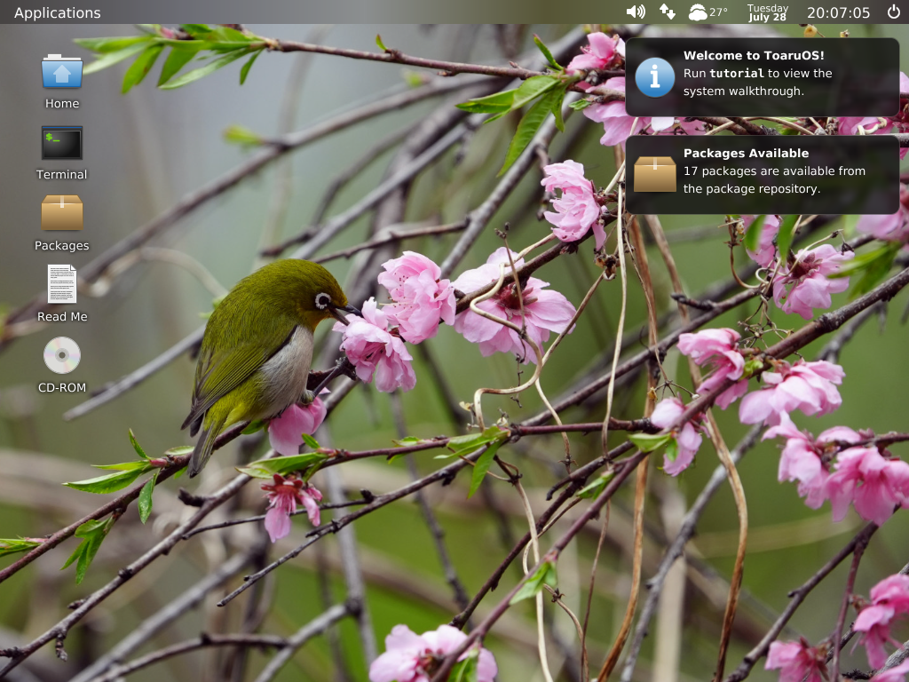
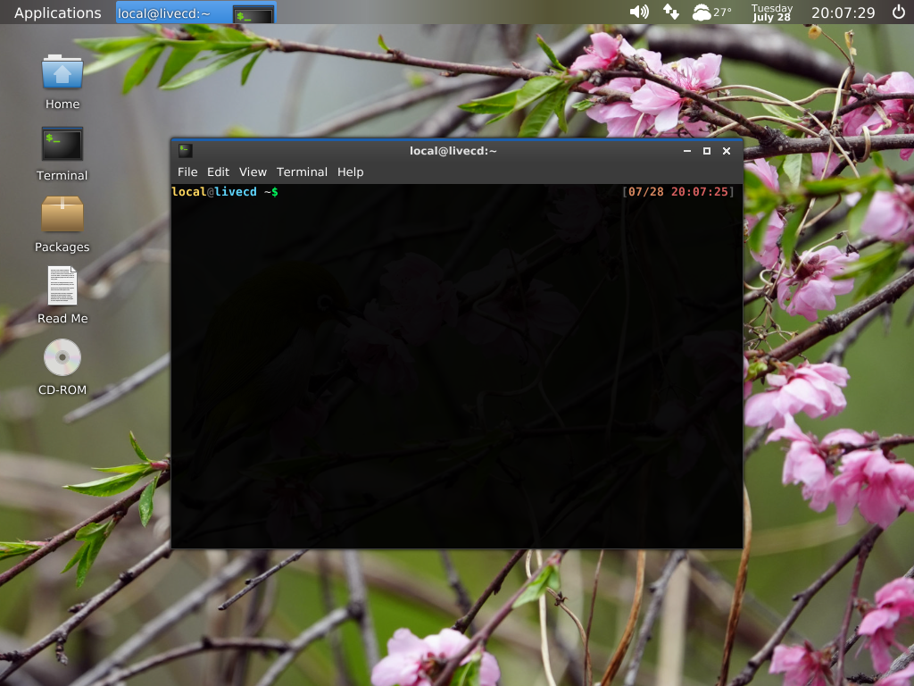

# VirtualBox Baseline Configuration

The unmodified ToaruOS 2.4.0 baseline was successfully boot-tested with Oracle
VirtualBox 7.0.18 on 2026-07-28.

## Tested configuration

| Setting | Tested value |
| --- | --- |
| VM name | `ToaruOS Baseline 2.4.0` |
| VM type | Other / Unknown (64-bit) |
| Firmware | BIOS |
| RAM | 1,024 MiB |
| CPUs | 2 |
| Chipset | PIIX3 |
| I/O APIC | Enabled |
| Graphics controller | VBoxVGA |
| Video memory | 64 MiB |
| 3D acceleration | Disabled |
| Storage controller | IDE, PIIX4 |
| Optical disk | `<repository-root>/image.iso`, IDE port 1/device 0 |
| Hard disk | None |
| Network | NAT |
| Adapter type | Intel PRO/1000 MT Desktop (`82540EM`) |
| Cable | Connected |
| Audio controller | Intel AC'97 |
| Audio output | Enabled |
| Pointing device | USB Tablet |
| Keyboard | PS/2 |
| Shared clipboard | Disabled |
| Drag and drop | Disabled |

`VBoxSVGA` also reached graphical userspace during testing, but `VBoxVGA` was
used for the final successful desktop validation because it best matches the
era and expectations of the project's custom VirtualBox integration. Do not
enable 3D acceleration; ToaruOS uses its own software-rendered compositor and
framebuffer path.

The ISO already contains a hybrid MBR, an El Torito BIOS loader, and an x86_64
EFI loader. Attach it directly as an optical disk. VDI/VMDK conversion and a
virtual hard disk are unnecessary for the live system.

## BIOS versus UEFI

BIOS was the tested baseline and is recommended first. The image also contains
`EFI/BOOT/BOOTX64.EFI`, so VirtualBox UEFI should be supported, but UEFI was
not needed for the successful baseline test.

## Reproducing the VM

With VirtualBox installed in its default Windows location:

```powershell
$vbox = 'C:\Program Files\Oracle\VirtualBox\VBoxManage.exe'
$name = 'ToaruOS Baseline 2.4.0'

& $vbox createvm --name $name --ostype Other_64 --register
& $vbox modifyvm $name `
  --memory 1024 --cpus 2 --chipset piix3 --firmware bios `
  --graphicscontroller vboxvga --vram 64 --accelerate3d off `
  --boot1 dvd --boot2 none --boot3 none --boot4 none `
  --nic1 nat --nictype1 82540EM --cableconnected1 on `
  --audio-enabled on --audio-out on --audio-driver default `
  --audio-controller ac97 --mouse usbtablet --keyboard ps2 `
  --usb on --usbehci off --usbxhci off `
  --clipboard-mode disabled --drag-and-drop disabled

& $vbox storagectl $name `
  --name IDE --add ide --controller PIIX4 --bootable on
& $vbox storageattach $name `
  --storagectl IDE --port 1 --device 0 --type dvddrive `
  --medium '<repository-root>\image.iso'
```

Start it with either the VirtualBox UI or:

```powershell
& $vbox startvm 'ToaruOS Baseline 2.4.0'
```

## Test evidence

VirtualBox's log confirmed:

```text
BIOS: Booting from CD-ROM...
Hello world, using VBox machine log for kernel output
Guest Additions capability report ... graphics: yes
NAT: DHCP offered IP address 10.0.2.15
```

The desktop reached a usable state with:

- the stock wallpaper and desktop launchers;
- the top panel and its application/system widgets;
- VirtualBox display integration;
- DHCP and package repository access;
- notifications;
- a terminal launched with Ctrl+Alt+T.

Desktop boot evidence:



Interactive terminal evidence:



## Existing test VM

The registered VM is:

```text
ToaruOS Baseline 2.4.0
UUID d0b784bf-c36c-48e6-a02b-0b5ded1e910f
```

Its configuration file is under the user's standard VirtualBox VM directory.
It has no writable disk, so forced power-off after testing cannot corrupt a
guest filesystem.
